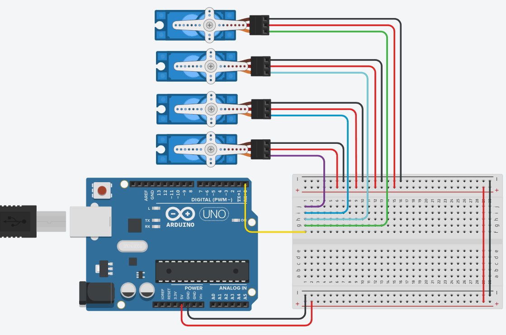

# 4 Servo Sweep Simulation

## Overview

This project demonstrates controlling four servo motors using an Arduino Uno.

The servo motors perform the following actions:

- Run using the Sweep example.
- Continue sweeping for 2 seconds.
- Stop and hold at 90 degrees.

## Components Used

- Arduino Uno
- 4 Servo Motors
- Breadboard
- Jumper Wires

## Files Included

- `4servo.ino` - Arduino source code
- `4servo.brd` - Circuit design file
- `circuit.png` - Circuit screenshot

## Circuit Diagram

## Simulation

Tinkercad Circuit:

[https://www.tinkercad.com/things/5TIoztE9Fh3-4servo/editel?returnTo=https%3A%2F%2Fwww.tinkercad.com%2Fdashboard&sharecode=iom48jn9tgCMeqK1qt3giNhvWKm7o38lT4FVN8QcMEw]

## Expected Output

All four servo motors move simultaneously for 2 seconds and then stop at 90 degrees.

## Author

V
